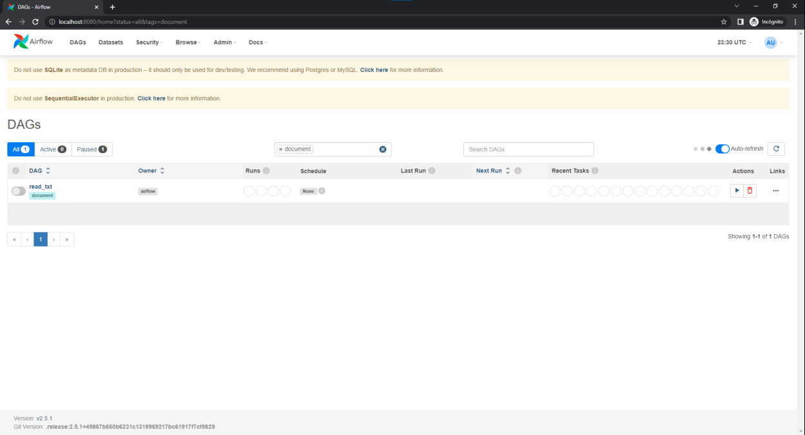
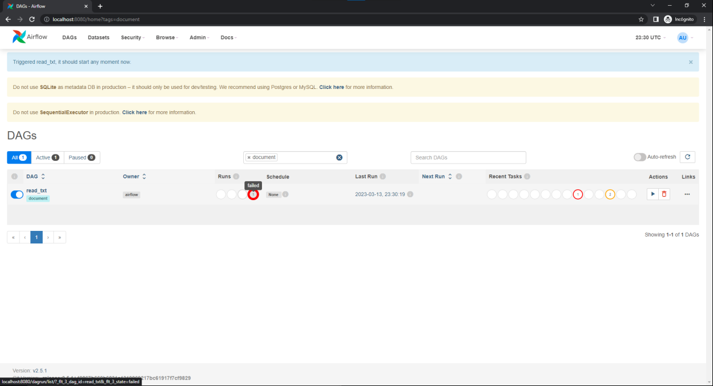
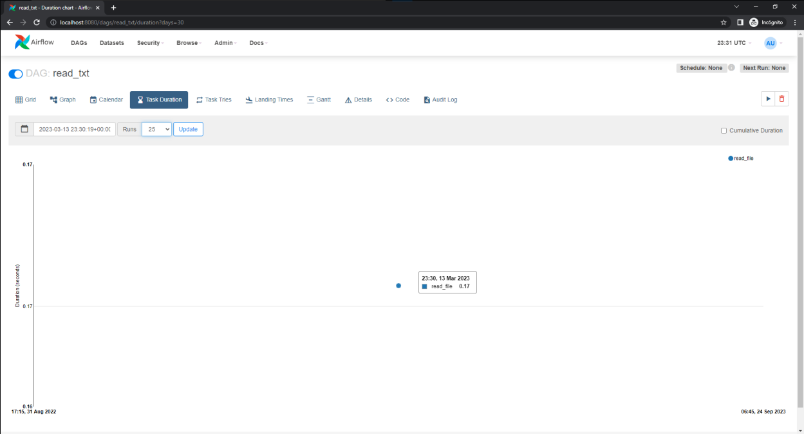
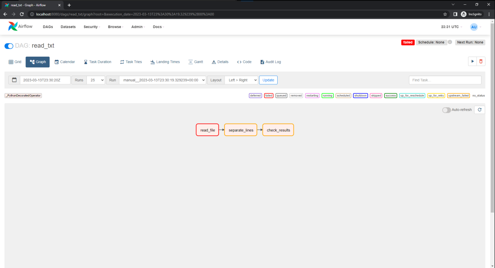

# Airflow

_Romo Valadez Jonathan Joshua_

_Computación tolerante a fallas_

_Universidad de Guadalajara_

_CUCEI_

_Departamento de ciencias computacionales_

---

## Introducción
En ocasiones los programas llegan a presentar errores en el flujo de datos, y lo que queremos es saber dónde se ocasionó el error, para esto nos sirve airflow, pues no termina el programa, sino que nos dice de los flujos de trabajo qué falló y qué no pudo continuar por ese fallo, así como otros datos, tal como el tiempo de ejecución de cada task.

---

## Desarrollo
En esta práctica, como se mencionó antes, se utilizará airflow, una herramienta muy útil para saber el flujo de trabajo de un programa, y los datos relacionados a cada task de este flujo.
Se utilizará de ejemplo la lectura de un archivo, como en la práctica de workflow, en el que intentarán transformar las lineas en datos de tipo flotante.

_Primero se crea una función para el flow, junto con datos del mismo, y se llama_

~~~python
@dag(
    dag_id="read_txt",
    schedule=None,
    start_date= datetime(2023, 3, 12),
    tags=["document"]
)

float_converter()
~~~

_La función de float_converter, siendo nuestro flow, tendrá todas las task del programa_

~~~python
def float_converter():
    @task()
    def read_file(path):
        archivo = open(path, "r")
        return archivo

    @task()
    def separate_lines(r):
        result = [float(line) for line in r]
        return result

    @task()
    def check_results(line):
        for number in line:
            print(number)

    path = "texto.txt"
    r = read_file(path)
    line = separate_lines(r)
    check_results(line)
~~~

_Con esto se podrá ver el flujo de datos en airflow, pero tendremos que poner el programa en una carpeta específica para que airflow lo reconozca_

_En este caso falló el programa, por lo que se verá en la página_

_Podremos ver la duración de los task, que en este caso es 1 solo task por la falla en la lectura del archivo_

_Por último podremos ver el flujo, dónde se mostrarán varios tipos de problemas, en este caso un fallo y dos tasks que no se pudieron ejecutar por el flujo_

## Conclusión
En esta actividad se logró ver otra herramienta para el flujo de datos, Airflow, sin embargo puede ser un poco más díficil de utilizar, por su falta de soporte en Windows.
Aún así es bastante útil y se lograrón apreciar diferentes características entre Airflow y Prefect, principalmente en la interfaz, que dependiendo la persona, una u otra puede ser más intuitiva o más útil.
