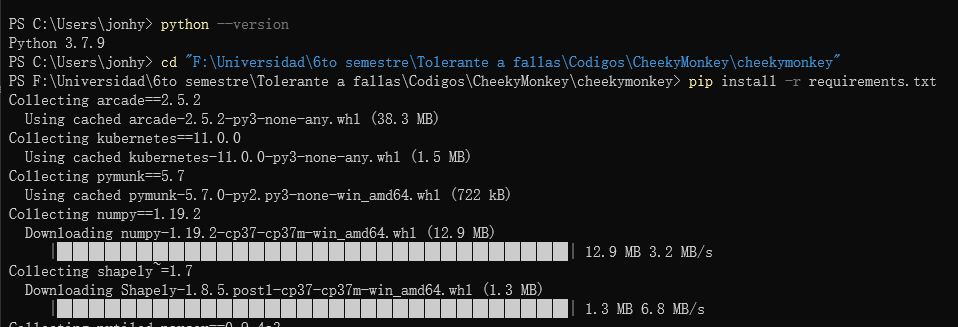
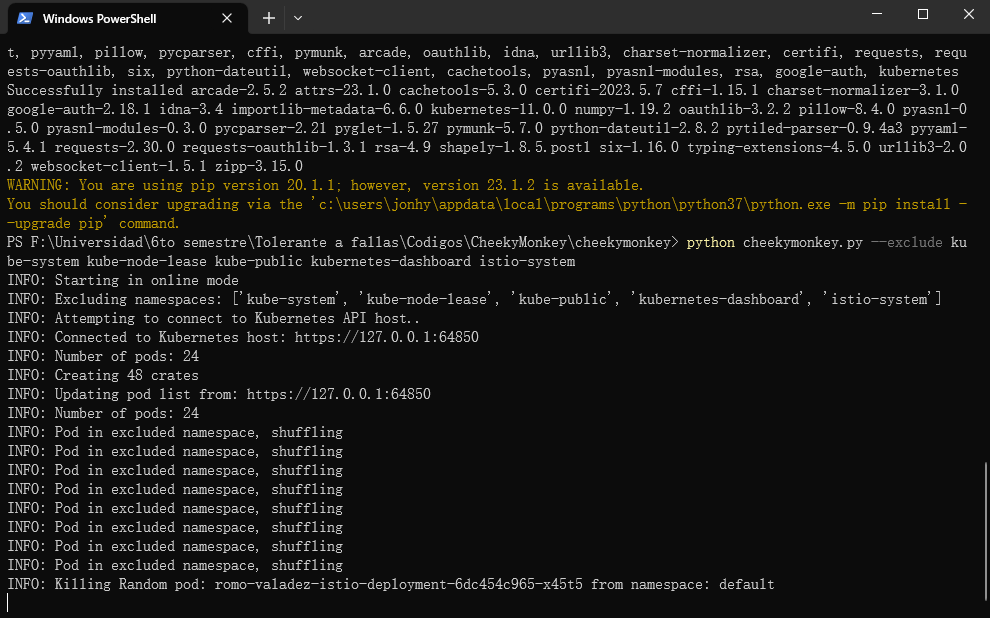
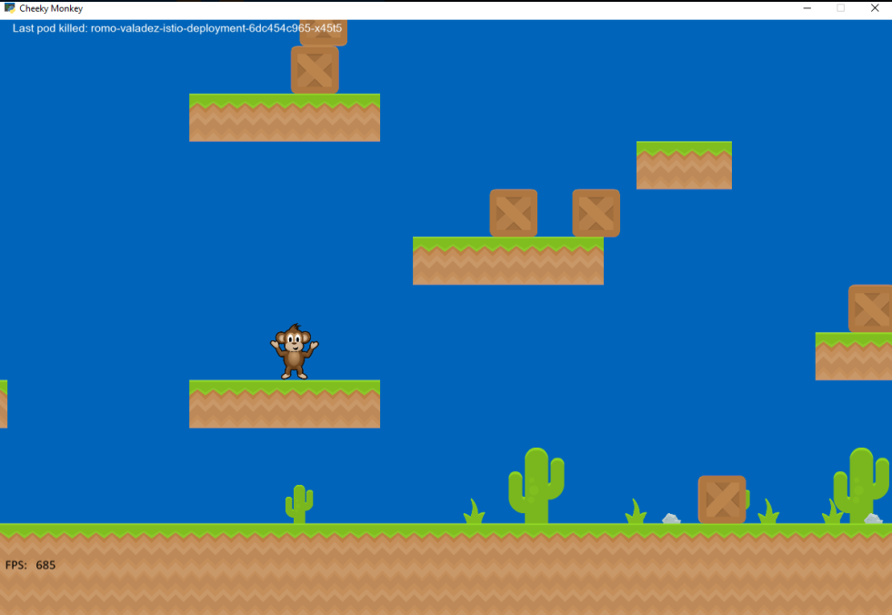
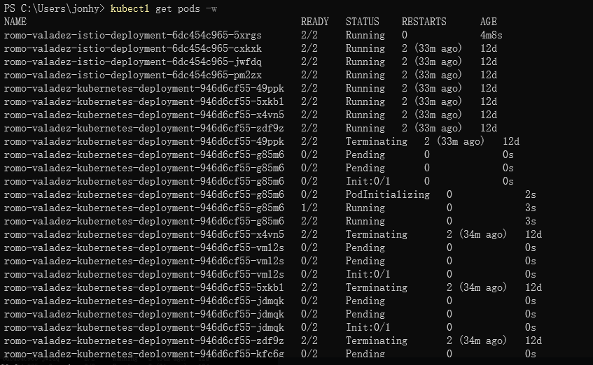

# Cheeky Monkey
_Romo Valadez Jonathan Joshua_

_Computación tolerante a fallas_

_Universidad de Guadalajara_

_CUCEI_

_Departamento de ciencias computacionales_

---

## Introducción
A veces hace falta caos para probar que algo funcione correctamente, y que, a pesar del caos, puede volver por sí mismo a ejecutarse. Este es el caso de Cheeky Monkey, que nos sirve para probar precisamente eso, se crea caos en los pods y se verifica que aun con todo el caos, el programa puede seguir siendo accesible.

---

## Desarrollo

Se utilizará el programa anterior en su totalidad para probar que sigue funcionando incluso con todo el caos.

Lo primero que se deberá de hacer es clonar el repositorio de cheeky monkey, y se deberán de instalar los requisitos de python.

Se verificará que contenedores se quieren excluir, ya que por defecto, cheeky monkey intentará destruir cualquier contenedor que encuentre, por lo que se excluirán los más importantes, como istio. Una vez teniendo en cuenta los contenedores que se quieren excluir se puede ejecutar el programa de la siguiente manera.

También se pueden configurar algunas cosas de Cheeky Monkey para que se adapte a lo que queremos, como la vida de las cajas, el numero de contenedores que elimina por cada caja, entre otras cosas. Y con todo listo se puede ver el juego, el cual como se puede apreciar, ya eliminó un contenedor.

Se puede verificar cómo se van volviendo a levantar los pods que se destruyeron.

---

## Conclusión
Esta actividad ayudó a aprender más sobre la ingeniería del caos, que es bastante útil, ya que con ello se puede probar que una aplicación permanecerá activa, incluso en los momentos más caóticos, y momentos graves como lo es eliminar un pod.

Esto fue muy interesante y se puede aplicar en muchas areas, pues cuando se quiere una aplicación tolerante a fallas completamente, casi siempre se llegan a pruebas enfocadas al caos, pues se toma en cuenta gente que solo quiere eso, ocasionar caos en una aplicación.
