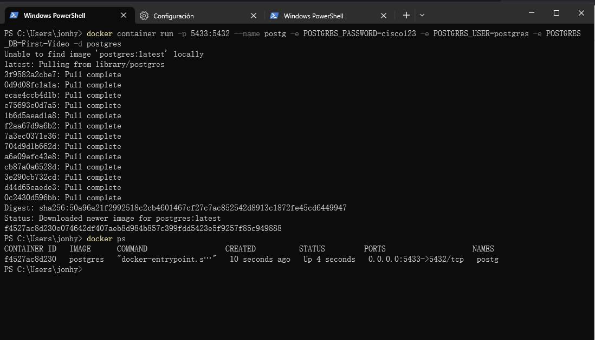
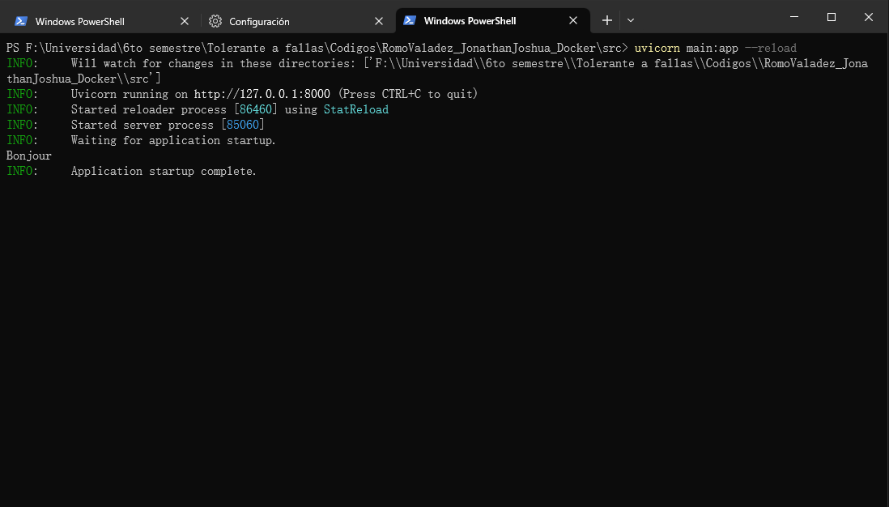
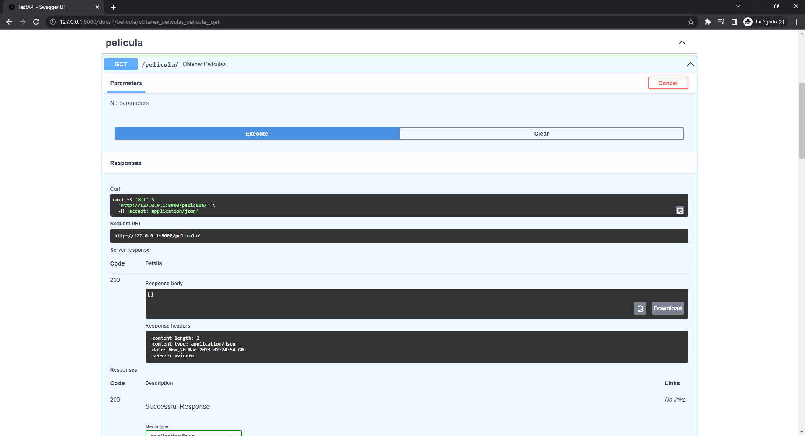
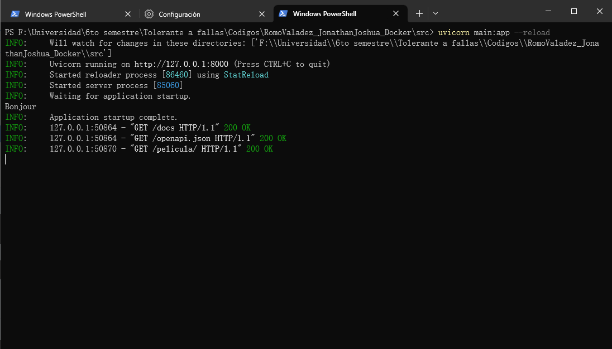

# Docker

_Romo Valadez Jonathan Joshua_

_Computación tolerante a fallas_

_Universidad de Guadalajara_

_CUCEI_

_Departamento de ciencias computacionales_

---

## Introducción
En ocasiones programar con multiples herramientas puede gastar muchos recursos para la computadora, principalmente memoria, por lo que es deseable programar sin gastar muchos de estos recursos. Para esto nos sirve docker, que solamente utiliza la herramienta que necesitamos, dejando de lado el area del sistema operativo, por lo que resulta mejor opción que otras como la virtualización.

---

## Desarrollo
En esta práctica, como se mencionó antes, se utilizará docker, por lo que para utilizarlo en Windows se deberá de instalar WSL (Windows Subsistem for Linux), y después docker desktop. Una vez hecho esto se podrán crear contenedores de docker, que en este caso se introducirá el siguiente comando para utilizar postgres en este ejemplo con una api.

~~~cmd
docker container run -p 5433:5432 --name postg -e POSTGRES_PASSWORD=cisco123 -e POSTGRES_USER=postgres -e POSTGRES_DB=First-Video -d postgres
~~~

En este ejemplo se utilizará el puerto 5433 para que la api pueda realizar acciones, esto para no generar conflictos con pgadmin si es que se encuentra instalado, y en la configuración de la api se podrán ver estas configuraciones.

~~~python
database = PostgresqlDatabase('First-Video',
                            user = 'postgres',
                            password = 'cisco123',
                            host = 'localhost',
                            port = 5433)
~~~

Se podrá comprobar si el contenedor se está ejecutando con docker ps.

Para ejecutar la api se deberá de instalar python 3.10 o menor debido a la compatibilidad de algunas de sus librerías. Se podrán instalar los requeririmientos desde la carpeta raíz del proyecto con el siguiente comando.

~~~cmd
pip install -r requirements.txt
~~~

Una vez instalados ya se podrá ejecutar la api desde la carpeta src con el siguiente comando.

~~~cmd
uvicorn main:app --reload
~~~

Si no funciona puede que uvicorn no sea reconocido, y se puede intentar de la siguiente manera.

~~~cmd
python -m uvicorn:app --reload
~~~

Con esto ya se podrá ver en ejecución la api, debido a que la propia api se encarga de crear las tablas en caso de que no se encuentren.

Se podrá hacer cualquier cosa que esté permitida en la api, en forma de pruebas, desde http://127.0.0.1:8000/docs

Por último, estas consultas se verán reflejadas en la ejecución de la api.

## Conclusión
En esta actividad se logró ver la utilidad de docker para utilizar herramientas sin el gasto de tantos recursos, lo cual es de bastante ayuda, pues en proyectos grandes, es probable que mucha gente esté involucrada, y con los contenedores se pueden evitar muchos problemas de compatibilidad y de uso de recursos.
