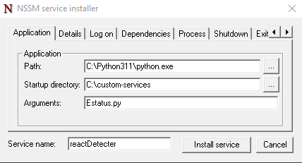

# Confirmar estado de un programa
_Romo Valadez Jonathan Joshua_

_Computación tolerante a fallas_

_Universidad de Guadalajara_

_CUCEI_

_Departamento de ciencias computacionales_

---

## Introducción
Cuando se tiene una página web hay veces en el que se cae, que pueden ser ocasionados por varios motivos, para esto se prefiere recurrir a un programa que automatiza el proceso de levantar la página de nuevo.

---

## Desarrollo
En esta práctica se utilizará python para lograr ver si se encuentra levantada una página en react, en caso de que no se levantará.

_Primero se requiere que se esté en la dirección del directorio donde se encuentra la aplicación de react, para así poder levantar la página de nuevo en caso de falla_

~~~python
os.chdir('F:/Universidad/6to semestre/Tolerante a fallas/Codigos/RomoValadez_JonathanJoshua_RestaurarEjecucion')
ip_addr = socket.gethostbyname('192.168.1.9')
~~~

_El programa se encontrará como un servicio por lo que se deberá de crear un bucle infinito, con un tiempo de espera de 1 minuto para comprobar que el puerto que se utiliza se encuentre abierto_

~~~python
portList = [5173]

while(True):
    for port in portList:
        try:
            sock = socket.socket(socket.AF_INET, socket.SOCK_STREAM)
            sock.settimeout(5)
            status = sock.connect_ex((ip_addr, port))
            if status == 0:
                print(f"Port: {port} - OPEN")
            else:
                print(f"Port: {port} - CLOSED")
                system("npm run dev")
            sock.close()
        except socket.error as err:
            print(f"Connection error: {err}")    
            sys.exit()
    
    time.sleep(60)
~~~

_Para poner el programa como servicio se recurrió a nssm que permite crear servicios a partir de códigos_

_Se inicia el servicio una vez se haya creado con nssm_

_El servicio lo podremos detectar desde el administrador de tareas_

_Podremos ver también iniciado Node js desde el administrador de tareas_

_Con esto aseguramos que podemos acceder a la página con la dirección que nos proporciona react_

_Para probar el servicio terminaremos el proceso de Node_

_Comprobaremos que la página ya no es accesible_

_Con el paso de 1 minuto del programa, este detectará que el puerto que utiliza react ya no se está usando, por lo que se reiniciará la ejecución_

_Se podrá comprobar que la página se volvió a levantar_

---

## Conclusión
Esta actividad fue muy útil pues permite ver la utilidad de los servicios con procesos automatizados.

En ocasiones se necesita algo que revise el estado de nuestros programas, pues varias veces queremos que estos programas permanezcan ejecutandose, por lo que esta actividad es muy útil para ver esto.
