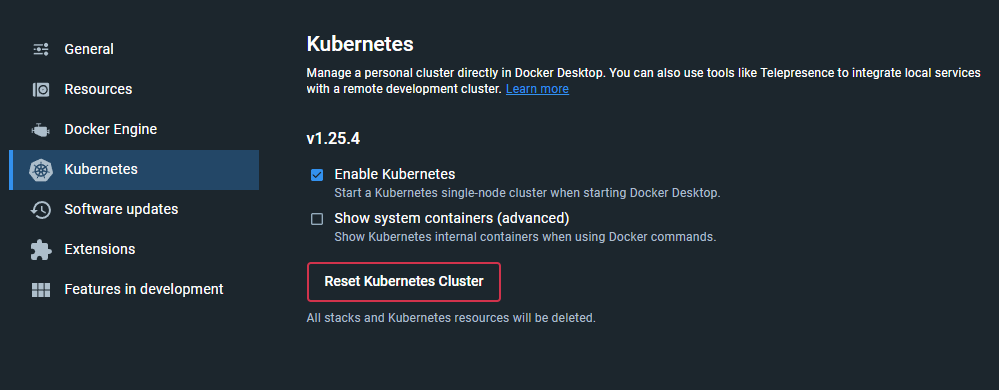
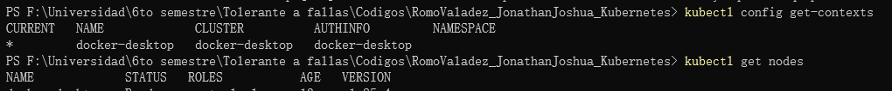
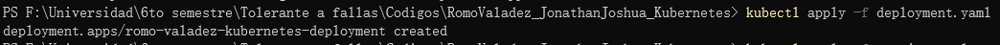
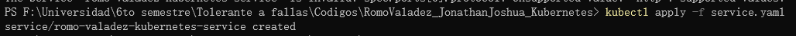
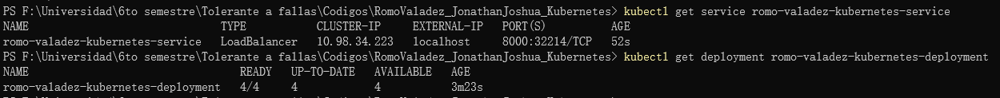
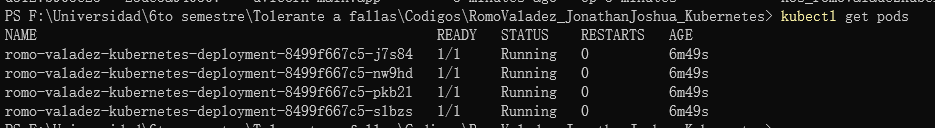
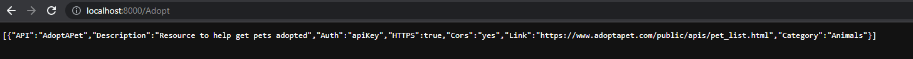
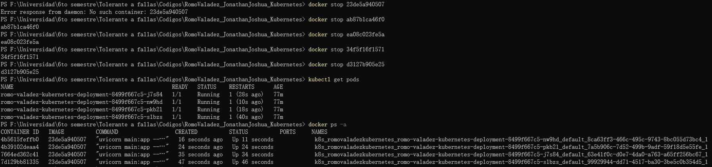

# Kubernetes
_Romo Valadez Jonathan Joshua_

_Computación tolerante a fallas_

_Universidad de Guadalajara_

_CUCEI_

_Departamento de ciencias computacionales_

---

## Introducción
En ocasiones necesitamos de varias replicas de una aplicación para que en caso de que falle, se cuente con otra replica y se restablezca el servicio de manera prácticamente inmediata, esto se puede lograr con kubernetes gracias a su funcionamiento.

---

## Desarrollo

### ¿Qué es Kubernetes?
Kubernetes es una plataforma portable y extensible de código abierto para administrar cargas de trabajo y servicios. Kubernetes facilita la automatización y la configuración declarativa.

###¿Qué es Ingress?
La opción de Ingress Controllers en Kubernetes se refiere a un tipo de balanceador de carga especializado para la plataforma, así como otros entornos relacionados con contenedores.

Esta opción se implementa con el objetivo de gestionar el tráfico de salida en el interior de un clúster para los servicios que necesitan comunicarse con otros por fuera del mismo clúster.

###¿Qué es un LoadBalancer?
El balance de carga (load Balance) se refiere a la distribución del tráfico de red entrante a través de un grupo de servidores backend, también conocido como Server Farm (conjunto de servidor) o Server Pool (conjunto de servidores).

Distribuye las solicitudes de los clientes o la carga de la red de manera eficiente en varios servidores.

### Programa de ejemplo
En este ejemplo se utilizará una api sencilla que utilice otra api, que obtiene datos de apis. Se hará una busqueda por el nombre de la api y se regresará el resultado.

~~~python
from fastapi import FastAPI
import requests

app = FastAPI()

@app.on_event("startup")
def startup():
    print("Bonjour")

@app.on_event("shutdown")
def shutdown():
    print("Arrive Derchi")

@app.get("/{Nombre}")
async def root(Nombre: str):
    lista = []
    response = requests.get('https://api.publicapis.org/entries')
    response = response.json()
    items = response['entries']
    item_list = list(items)
    for item in item_list:
        posicion = item["API"].find(Nombre)
        if posicion != -1:
            lista.append(item)
    return lista
~~~

Se creará una imagen en docker que nos permita usar el kluster por medio de un archivo yaml. Los archivos yaml que se utilizarán serán uno para el deployment

~~~yaml
apiVersion: apps/v1
kind: Deployment
metadata:
  name: romo-valadez-kubernetes-deployment
  labels:
    app: romovaladezkubernetes
spec:
  replicas: 4
  selector:
    matchLabels:
      app: romovaladezkubernetes
  template:
    metadata:
      labels:
        app: romovaladezkubernetes
    spec:
      containers:
      - name: romovaladezkubernetes
        image: jonhyble/romo_valadez_kubernetes:1.0
        ports:
        - containerPort: 8000
~~~

También un yaml para el service

~~~yaml
apiVersion: v1
kind: Service
metadata:
  name: romo-valadez-kubernetes-service
  labels:
    app: romo-valadez-kubernetes-service
spec:
  type: LoadBalancer
  selector:
    app: romovaladezkubernetes
  ports:
    - protocol: TCP
      port: 8000
      targetPort: 8000
  sessionAffinity: None
~~~

Se ocupará activar kubernetes en docker desktop.

Y configurarlo.

Se aplicará el yaml del deployment.

Se aplicará el yaml del service.

Se comprobará que se hayan aplicado ambos yaml.

Se podrá comprobar que se está ejecutando el kluster.

Se podrá ver que la aplicación funciona correctamente en localhost.

Aunque se intenten detener los contenedores, se volverán a levantar.

---

## Conclusión
Esta actividad ayudó mucho para aprender una herramienta bastante poderosa como lo es kubernetes, la cual permite crear replicas de un servicio, lo cual implica que existe tolerancia a fallas.

Esta tolerancia a fallas es bastante buena, pues al caer el servicio puede recuperarse casi inmediatamente gracias a las replicas.
