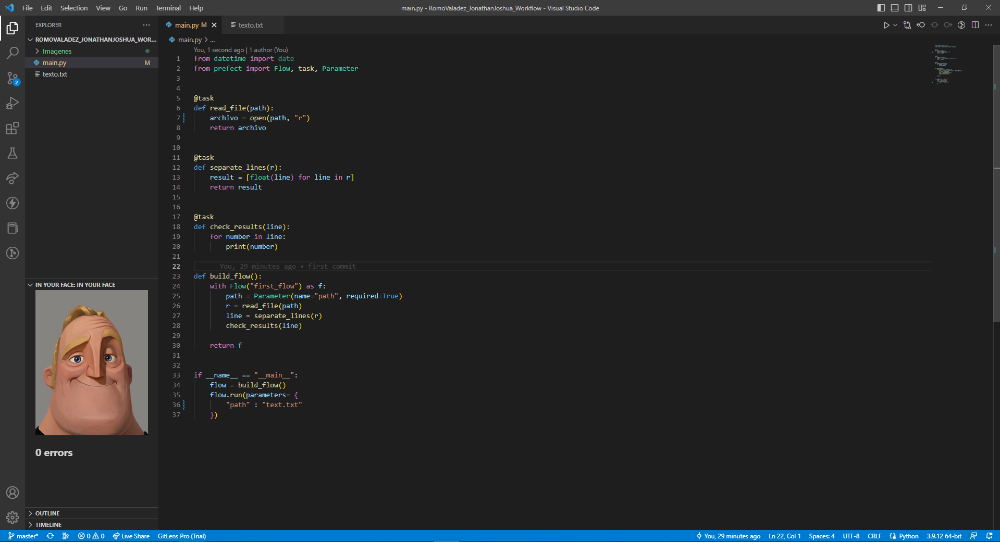

# Workflow

_Romo Valadez Jonathan Joshua_

_Computación tolerante a fallas_

_Universidad de Guadalajara_

_CUCEI_

_Departamento de ciencias computacionales_

---

## Introducción
En ocasiones los programas llegan a presentar errores en el flujo de datos, y lo que queremos es saber dónde se ocasionó el error, para esto nos sirve prefect, pues no termina el programa, sino que nos dice de los flujos de trabajo que falló y qué no pudo continuar por ese fallo.

---

## Desarrollo
En esta práctica, como se mencionó antes, se utilizará prefect, una herramienta muy útil para saber el flujo de trabajo de un programa.
Se utilizará de ejemplo la lectura de un archivo, en el que intentarán transformar las lineas en datos de tipo flotante.

_Primero se crea una función para el flow y se llama junto con parametros_

~~~python
if __name__ == "__main__":
    flow = build_flow()
    flow.run(parameters= {
        "path" : "texto.txt"
    })
~~~

_La función para el flow es la siguiente, en la que se llamarán a todas las funciones, o tasks, del programa_

~~~python
def build_flow():
    with Flow("first_flow") as f:
        path = Parameter(name="path", required=True)
        r = read_file(path)
        line = separate_lines(r)
        check_results(line)

    return f
~~~

_Las funciones, o tasks, utilizadas en nuestro programa son las siguientes_

~~~python
@task
def read_file(path):
    archivo = open(path, "r")
    return archivo

@task
def separate_lines(r):
    result = [float(line) for line in r]
    return result

@task
def check_results(line):
    for number in line:
        print(number)
~~~

_Con esto ya se nos permitirá verificar dónde ocurrió un error, por ejemplo, si hay un error en el nombre del archivo y no lo encuentra_

_También nos permitirá verificar errores en el flujo de trabajo_

_Por último, si el programa fue ejecutado de forma exitosa, se verá de la siguiente forma_

## Conclusión
En esta actividad se logró ver la utilidad de prefect, que nos permite identificar en que parte del flujo del programa ocurrió un error, y las razones por las que no se podría continuar en otros puntos.
